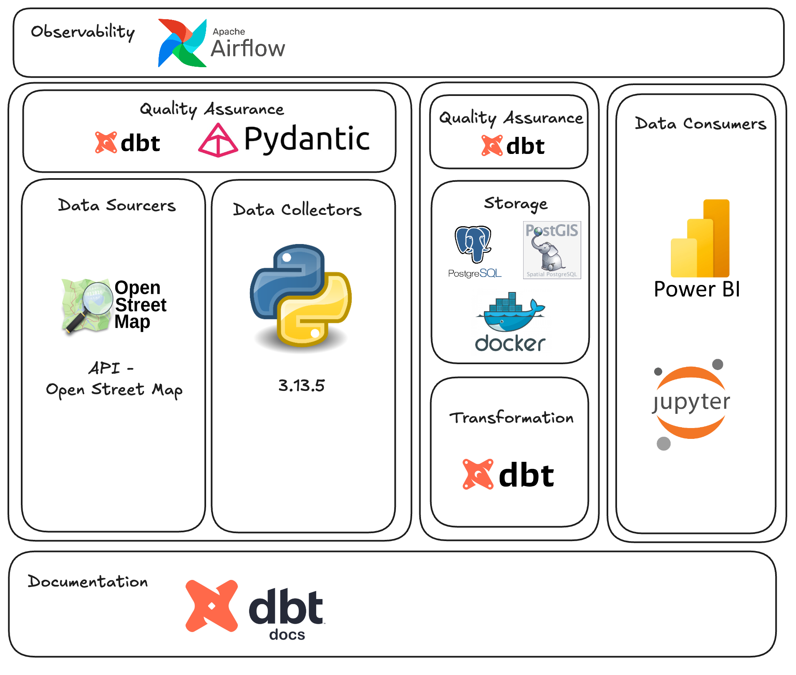

# portugal_project

## [PT] Este projeto realiza a coleta, armazenamento e transformação de dados públicos da cidade de Braga para análise de infraestrutura urbana.

## [EN] This project involves the collection, storage, and transformation of public data from the city of Braga for urban infrastructure analysis.

